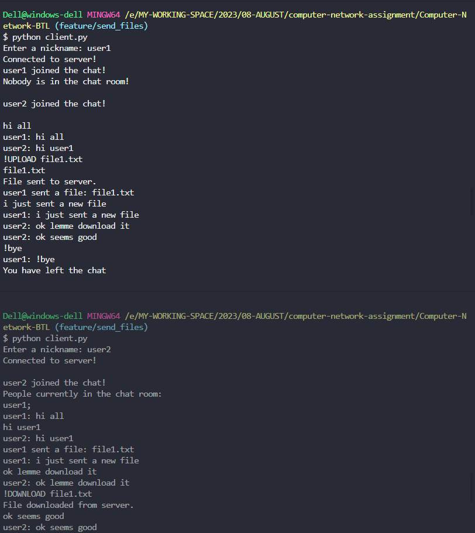

## HOW TO UPLOAD/RECEIVE FILES

- Upload file: by sending a message starting with `!UPLOAD` e.g. `!UPLOAD file1.txt`
- Download file: by sending a message starting with `!DOWNLOAD` e.g. `!DOWNLOAD file1.txt`

## DEMO

## IMPROVEMENTS

- [**DONE**] At present, the connection is torn down after each uploading/downloading request. The client and server must be restarted to work again. This can be solved by sending the file size before sending the file contents. The server can then read the file size and keep the connection open until the file size is reached. This will allow the client to send multiple files without restarting the connection. [Reference](https://stackoverflow.com/questions/30128079/how-to-send-end-of-file-without-closing-tcp-socket)
